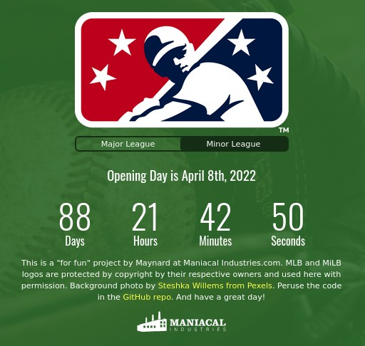

# The Over-thought Baseball Opening Day Countdown Clock

[Click me to see it live!](https://maniacalmaynard.github.io/baseballCountdown/)

This project is for-fun and intended to be a practice and portfolio project that simply counts down to major and minor league opening days. If you are reading this and think "hey, what they could have done better was XYZ!" then please message me, I'd love to hear from ya!

### The Future Features List:

Select your specific team for exact date and time:

- Automatically by location. This should be a button to opt-in for location retrieval. The location info will be used to search for the closest team.

- Search by city, state. Simple form to search and return the correct team if one exists for that city, state.

- Visual Menu. First choose MLB or MiLB, then choose Division, then choose Team. Note: This will likely be the first functionality for v1.0 with the others being saved for updates.

Once selected, the countdown clock will change to the exact expected time of the first pitch for that team, the colors of the clock will change from generic to the colors of the selected team, and the title will change to "<yourteam> will play ball in:"

Things to consider:

Setting up the data with JSON to more easily transfer to a noSQL database. If I move this project past v1.0 then a database might be better. Probably firebase.

Finding the closest team to city, state info should be interesting but needs to be fairly accurate both by location and by form entry search. Otherwise it could be super frustrating for users near a team but not in the exact same town.

- Might include background images from the actual field associated with the selected team.

- Could add ticket links to the chosen team's ticket system. Will require some further research as I'm not sure all of the teams use anything with a proper API, esp. the minor teams. Requires further research
